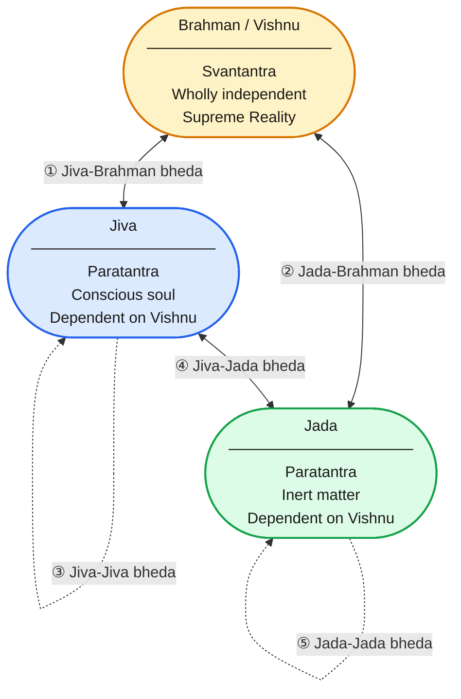

# Madhva's Complete Philosophy Explained: The Eternal Truth of Dvaita Vedanta

> **Video:** *(Coming soon — companion document prepared ahead of recording)*

---

## Table of Contents

- [Introduction](#introduction)
  - [The Fragmented Appearance of Madhva's Teaching](#the-fragmented-appearance-of-madhvas-teaching)
  - [The Common Misconception: Dvaita as Mere Theism](#the-common-misconception-dvaita-as-mere-theism)
  - [One Unified Philosophical System](#one-unified-philosophical-system)
  - [How Dvaita Answers Every Fundamental Question](#how-dvaita-answers-every-fundamental-question)
  - [The Boldness of Madhva's Claim](#the-boldness-of-madhvas-claim)
  - [A Philosophy That Demands Rigor, Not Just Faith](#a-philosophy-that-demands-rigor-not-just-faith)
  - [Begin at the Foundation](#begin-at-the-foundation)
- [1. Vishnu as the Supreme Independent Reality (Sarvottama)](#1-vishnu-as-the-supreme-independent-reality-sarvottama)
  - [The Central Axiom of Dvaita](#the-central-axiom-of-dvaita)
  - [Svantantra: The One Fully Independent Being](#svantantra-the-one-fully-independent-being)
  - [Everything Else Is Paratantra: Dependent on Vishnu](#everything-else-is-paratantra-dependent-on-vishnu)
  - [Vishnu Is Not an Abstraction — He Is a Person](#vishnu-is-not-an-abstraction--he-is-a-person)
  - [Lakshmi: The Eternal Consort and Mediator](#lakshmi-the-eternal-consort-and-mediator)
  - [Vishnu's Omniscience, Omnipotence, and Omnipresence Are Real](#vishnus-omniscience-omnipotence-and-omnipresence-are-real)
  - [Three Positions on the Same Texts: Where Dvaita Stands](#three-positions-on-the-same-texts-where-dvaita-stands)
- [2. The Five Real Differences (Pancha-bheda)](#2-the-five-real-differences-pancha-bheda)
  - [The Structural Backbone of Dvaita](#the-structural-backbone-of-dvaita)
  - [The First Difference: Jiva and Brahman](#the-first-difference-jiva-and-brahman)
  - [The Second Difference: Jada and Brahman](#the-second-difference-jada-and-brahman)
  - [The Third Difference: Jiva and Jiva](#the-third-difference-jiva-and-jiva)
  - [The Fourth Difference: Jiva and Jada](#the-fourth-difference-jiva-and-jada)
  - [The Fifth Difference: Jada and Jada](#the-fifth-difference-jada-and-jada)
  - [These Differences Are Eternal and Real, Not Illusory](#these-differences-are-eternal-and-real-not-illusory)
  - [Why Real Difference Does Not Diminish God](#why-real-difference-does-not-diminish-god)
- [3. The World Is Real (Jagat Satyatva)](#3-the-world-is-real-jagat-satyatva)
  - [Madhva's Direct Rejection of Jagat-Mithyatva](#madhvas-direct-rejection-of-jagat-mithyatva)
  - [Prakriti: Real, Eternal, Dependent Matter](#prakriti-real-eternal-dependent-matter)
  - [Creation Is Not Projection — It Is Real Making](#creation-is-not-projection--it-is-real-making)
  - [Why the Reality of the World Matters for Ethics](#why-the-reality-of-the-world-matters-for-ethics)
  - [Suffering in a Real World Has Real Meaning](#suffering-in-a-real-world-has-real-meaning)
  - [The World as Vishnu's Lila Without Canceling Its Reality](#the-world-as-vishnus-lila-without-canceling-its-reality)
- [4. The Individual Soul (Jiva)](#4-the-individual-soul-jiva)
  - [The Jiva Is Real, Individual, and Eternal](#the-jiva-is-real-individual-and-eternal)
  - [The Jiva Is Anu: Atomic in Size](#the-jiva-is-anu-atomic-in-size)
  - [The Jiva Is Conscious but Dependent](#the-jiva-is-conscious-but-dependent)
  - [Every Jiva Has an Inherent Nature (Svabhava)](#every-jiva-has-an-inherent-nature-svabhava)
  - [The Jiva Is a Reflection of Vishnu, Not Vishnu Himself](#the-jiva-is-a-reflection-of-vishnu-not-vishnu-himself)
  - [Bondage: The Jiva Covered by Avidya](#bondage-the-jiva-covered-by-avidya)
  - [Why the Jiva Can Never Become Brahman](#why-the-jiva-can-never-become-brahman)
- [5. The Hierarchy of Souls (Taratamya)](#5-the-hierarchy-of-souls-taratamya)
  - [Not All Souls Are Equal: The Doctrine of Taratamya](#not-all-souls-are-equal-the-doctrine-of-taratamya)
  - [The Three Eternal Categories of Jivas](#the-three-eternal-categories-of-jivas)
  - [Mukti-Yogyas: Souls Destined for Liberation](#mukti-yogyas-souls-destined-for-liberation)
  - [Nitya-Samsarins: Souls Bound to Endless Transmigration](#nitya-samsarins-souls-bound-to-endless-transmigration)
  - [Tamo-Yogyas: Souls Destined for Eternal Darkness](#tamo-yogyas-souls-destined-for-eternal-darkness)
  - [The Hierarchy Within Liberated Souls](#the-hierarchy-within-liberated-souls)
  - [Mukhya Prana at the Apex of All Jivas](#mukhya-prana-at-the-apex-of-all-jivas)
  - [Why Taratamya Does Not Contradict Divine Justice](#why-taratamya-does-not-contradict-divine-justice)
- [6. Maya: Vishnu's Real Creative Power](#6-maya-vishnus-real-creative-power)
  - [Maya in Dvaita Is Not Illusion](#maya-in-dvaita-is-not-illusion)
  - [Maya as the Creative Shakti of Vishnu](#maya-as-the-creative-shakti-of-vishnu)
  - [How Maya Produces the Universe](#how-maya-produces-the-universe)
  - [Avidya: The Covering That Causes Bondage](#avidya-the-covering-that-causes-bondage)
  - [The Difference Between Maya and Avidya in Dvaita](#the-difference-between-maya-and-avidya-in-dvaita)
  - [Why the World Produced by Maya Is Not an Error](#why-the-world-produced-by-maya-is-not-an-error)
- [7. Karma and the Mechanism of Bondage](#7-karma-and-the-mechanism-of-bondage)
  - [Karma as the Engine of Samsara](#karma-as-the-engine-of-samsara)
  - [Three Types of Karma](#three-types-of-karma)
  - [Karma Alone Cannot Liberate — Only Vishnu's Grace Can](#karma-alone-cannot-liberate--only-vishnus-grace-can)
  - [The Role of Adrishta: Unseen Results of Action](#the-role-of-adrishta-unseen-results-of-action)
  - [Karma Operates Under Vishnu's Superintendence](#karma-operates-under-vishnus-superintendence)
  - [Renouncing Fruits Without Renouncing Action](#renouncing-fruits-without-renouncing-action)
  - [Why Effort Still Matters Despite Predestination](#why-effort-still-matters-despite-predestination)
- [8. The Role of Mukhya Prana (Vayu)](#8-the-role-of-mukhya-prana-vayu)
  - [Vayu: The Foremost Among All Jivas](#vayu-the-foremost-among-all-jivas)
  - [Vayu as Cosmic Intermediary Between Vishnu and All Souls](#vayu-as-cosmic-intermediary-between-vishnu-and-all-souls)
  - [Hanuman in the Treta Yuga](#hanuman-in-the-treta-yuga)
  - [Bhima in the Dvapara Yuga](#bhima-in-the-dvapara-yuga)
  - [Madhva Himself as Vayu's Third Avatara in the Kali Yuga](#madhva-himself-as-vayus-third-avatara-in-the-kali-yuga)
  - [Vayu Ensures the Authenticity of All True Spiritual Knowledge](#vayu-ensures-the-authenticity-of-all-true-spiritual-knowledge)
  - [Why the Concept of Vayu Is Central to Dvaita Practice](#why-the-concept-of-vayu-is-central-to-dvaita-practice)
- [9. Valid Knowledge (Pramana): How We Know Truth](#9-valid-knowledge-pramana-how-we-know-truth)
  - [Epistemology as the Gateway to Metaphysics](#epistemology-as-the-gateway-to-metaphysics)
  - [The Three Valid Sources of Knowledge](#the-three-valid-sources-of-knowledge)
  - [Pratyaksha: Direct Perception as Valid Knowledge](#pratyaksha-direct-perception-as-valid-knowledge)
  - [Anumana: Inference and Its Limits](#anumana-inference-and-its-limits)
  - [Shabda: Vedic Testimony as Supreme Pramana](#shabda-vedic-testimony-as-supreme-pramana)
  - [Sakshi: The Inner Witness Consciousness](#sakshi-the-inner-witness-consciousness)
  - [Vishnu as the Ultimate Guarantor of All Valid Knowledge](#vishnu-as-the-ultimate-guarantor-of-all-valid-knowledge)
  - [Why Error Exists and How It Is Corrected](#why-error-exists-and-how-it-is-corrected)
- [10. Bhakti: The Path to Liberation](#10-bhakti-the-path-to-liberation)
  - [Bhakti Is Not Mere Emotion — It Is Cognitive Love](#bhakti-is-not-mere-emotion--it-is-cognitive-love)
  - [Jnana as the Foundation of True Bhakti](#jnana-as-the-foundation-of-true-bhakti)
  - [The Stages of Bhakti Practice](#the-stages-of-bhakti-practice)
  - [Para-Bhakti: The Highest Form of Devotion](#para-bhakti-the-highest-form-of-devotion)
  - [The Role of Guru in Transmitting True Knowledge](#the-role-of-guru-in-transmitting-true-knowledge)
  - [Sadhana-Pancha-Bheda: Practice Rooted in Real Difference](#sadhana-pancha-bheda-practice-rooted-in-real-difference)
  - [Vishnu's Grace (Anugraha) Is the Final Cause of Liberation](#vishnus-grace-anugraha-is-the-final-cause-of-liberation)
  - [Why Bhakti Without Correct Philosophy Cannot Fully Liberate](#why-bhakti-without-correct-philosophy-cannot-fully-liberate)
- [11. Moksha: Liberation in Vishnu's Eternal Presence](#11-moksha-liberation-in-vishnus-eternal-presence)
  - [What Moksha Means in Dvaita](#what-moksha-means-in-dvaita)
  - [Liberation Is Not Merger — Individuality Is Eternal](#liberation-is-not-merger--individuality-is-eternal)
  - [Sri Vaikuntha: The Eternal Abode](#sri-vaikuntha-the-eternal-abode)
  - [Ananda-Taratamya: Graded Bliss Even in Liberation](#ananda-taratamya-graded-bliss-even-in-liberation)
  - [The Mukta Jiva's Relationship with Vishnu in Liberation](#the-mukta-jivas-relationship-with-vishnu-in-liberation)
  - [Dvaita's Moksha Is More Personally Meaningful](#dvaitas-moksha-is-more-personally-meaningful)
  - [Liberation Does Not Erase the Past — It Fulfills It](#liberation-does-not-erase-the-past--it-fulfills-it)
- [12. How the Pieces Fit Together: The Complete Unified System](#12-how-the-pieces-fit-together-the-complete-unified-system)
  - [How All the Pieces Connect](#how-all-the-pieces-connect)
  - [Dvaita's Answers Are Clear Where Others Are Evasive](#dvaitas-answers-are-clear-where-others-are-evasive)
  - [The Practical Implications of Living by Dvaita](#the-practical-implications-of-living-by-dvaita)
  - [The Complete System Demands Intellectual Honesty](#the-complete-system-demands-intellectual-honesty)
  - [Madhva's Promise to the Sincere Seeker](#madhvas-promise-to-the-sincere-seeker)

---

## Introduction

### The Fragmented Appearance of Madhva's Teaching

When you first encounter the philosophy of Madhvacharya, it can appear as a demanding and scattered collection of polemics, devotional injunctions, and technical commentary. One text establishes the sovereignty of Vishnu. Another refutes Shankara's non-dualism with relentless logical precision. A third outlines the hierarchy of souls. A fourth describes the nature of valid knowledge. A fifth establishes the categories of bound and liberated beings. You move from metaphysics to epistemology to cosmology to devotional practice, each topic feeling like a separate discipline requiring separate expertise.

### The Common Misconception: Dvaita as Mere Theism

Most people who encounter Madhva's Dvaita Vedanta reduce it to a form of conventional theism. God exists, souls exist, the world exists, they are all different — and therefore worship God to be liberated. This summary is not wrong, but it is catastrophically incomplete. Treating Dvaita this way is like treating a precisely engineered bridge as merely something that helps you cross a river. The engineering is the point. The structural necessity of every element is the point. The reasons why it must be built exactly this way and cannot be built any other way — that is what Madhva's philosophy is truly about.

### One Unified Philosophical System

Madhvacharya's entire body of work — thirty-seven texts covering the Brahmasutras, the ten principal Upanishads, the Bhagavad Gita, the Bhagavata Purana, the Mahabharata, and independent philosophical treatises — is not a collection of separate commentaries loosely grouped under one tradition. It is one rigorously unified philosophical system where every element is logically entailed by every other. The doctrine of pancha-bheda, the five real differences, is not merely a metaphysical claim. It is the logical consequence of Vishnu's absolute independence. The doctrine of taratamya, the graded hierarchy of souls, is not merely a theological assertion. It is the natural consequence of the reality of individual differences. Every piece requires every other piece for the entire structure to stand.

### How Dvaita Answers Every Fundamental Question

When you understand Dvaita as a unified system, it provides precise and satisfying answers to every fundamental question a conscious being can raise. What is the nature of ultimate reality? What am I? What is the world? Why is there suffering? What is the purpose of life? What happens after death? Is liberation the end of individuality? What is the relationship between the soul and God? Why does God permit evil? Madhva's system answers all of these questions — not with vague pointers toward ineffable mystery, but with clear, logically coherent, and verifiable philosophical positions.

### The Boldness of Madhva's Claim

Madhva's philosophical position is one of the boldest in the entire history of Indian thought. He directly and explicitly rejected the Advaita Vedanta of Adi Shankaracharya — the dominant philosophical school of his time — calling it a form of concealed nihilism. He rejected Ramanuja's Vishishtadvaita as an incomplete compromise. He claimed that his interpretation of the Brahmasutras, the Upanishads, and the Gita was the only correct one — that all other interpretations had fundamentally misread these texts. He made this claim not through authority alone but through what he presented as rigorous logical analysis and direct scriptural evidence. Whether or not you ultimately agree with his position, the intellectual courage and precision of his argumentation demand serious engagement.

### A Philosophy That Demands Rigor, Not Just Faith

Dvaita Vedanta is not a philosophy for those who want comfortable reassurance without intellectual effort. It invites — indeed demands — the most rigorous analysis of experience, scripture, and logic. Madhva was famously willing to follow the argument wherever it led, even when it arrived at conclusions that contradicted popular religious sentiment. He insisted that genuine devotion must be grounded in genuine knowledge. Bhakti built on philosophical error is unstable. Bhakti built on correct understanding is unshakeable. This is why he spent as much effort on epistemology and logic as on devotional practice.

### Begin at the Foundation

To truly understand what Madhva taught, we must begin exactly where he began — not with devotional practice, not with cosmology, not with the nature of the soul, but with the most fundamental question of all: What is ultimately, independently, absolutely real? His answer to this question generates every other element of his system. Let us begin there and build upward, each layer arising necessarily from the one below it.

---

## 1. Vishnu as the Supreme Independent Reality (Sarvottama)

### The Central Axiom of Dvaita

At the absolute foundation of Madhva's entire philosophical system stands one irreducible claim: Vishnu alone is Sarvottama — the highest of all, superior to everything that exists. This is not a devotional preference or a cultural inheritance. It is, in Madhva's view, the logically necessary conclusion of any rigorous analysis of what it means for something to be genuinely and ultimately real. Ultimate reality must be self-existent, causally independent, and dependent on nothing outside itself for its being, its knowledge, or its power. Madhva's central argument is that only Vishnu satisfies these conditions. Everything else — every soul, every atom of matter, every god, every form of consciousness in the universe — exists conditionally, dependently, and partially.

### Svantantra: The One Fully Independent Being

The technical term Madhva uses for Vishnu's ultimate nature is Svantantra — fully self-dependent. A being is truly independent only if its existence does not require anything outside itself, its knowledge is not derived from any external source, its action is not constrained by any external force, and its nature cannot be altered by any external power. Vishnu alone meets all of these conditions simultaneously. He knows all things by his own nature, not by being informed. He acts by his own will, not by being moved. He exists by his own essence, not by being caused. He needs no substrate, no support, no prior cause, and no external validation. This absolute independence is not a theological claim imposed on the texts from outside — it is, Madhva argues, precisely what the Vedic texts mean when they call Brahman the cause of the universe.

### Everything Else Is Paratantra: Dependent on Vishnu

By logical contrast, everything other than Vishnu is Paratantra — dependent on another for its being and function. Individual souls are conscious but they do not possess knowledge independently; their knowledge depends on Vishnu's will for its activation. Matter is real but inert; it cannot organize itself into a cosmos without Vishnu's direction. Even the great gods — Brahma, Shiva, Indra — are themselves souls of a higher order who depend entirely on Vishnu for their existence and their powers. None of them are independently real in the way Vishnu is independently real. They exist, they know, they act — but only because Vishnu permits and sustains it. This is not a hierarchy of power in the ordinary sense. It is a metaphysical claim about the ultimate structure of reality itself.

Consider the difference between a lamp and a mirror. The lamp originates its own light. The mirror only shines because a lamp exists elsewhere. You can surround a mirror with other mirrors and fill a room with reflected brightness — but trace any of that brightness back to its source and you arrive at the lamp that no other lamp lit. Every conscious being in the universe shines with awareness, but that awareness is reflected, borrowed, sustained by the one consciousness that originates its own light. This is the distinction Madhva is drawing. Vishnu is the lamp. Everything else is a mirror.

### Vishnu Is Not an Abstraction — He Is a Person

One of Madhva's most emphatic points is that Vishnu is not an impersonal absolute, not a featureless consciousness behind appearances, not a void into which all distinctions dissolve. Vishnu is a person. He has a real, eternal, spiritual form (divya-deha). He has real attributes: omniscience (sarvajnatva), omnipotence (sarva-shaktitva), perfect bliss (anandata), perfect beauty (saundarya), perfect goodness (saushilya). These attributes are not limiting conditions imposed on an unlimited absolute. They are the eternal, real, positive characteristics of the highest being. When the Upanishads and Puranas describe Vishnu's form and qualities, Madhva insists, they are speaking literally, not metaphorically. The personal God of devotion and the ultimate reality of philosophy are one and the same being.

### Lakshmi: The Eternal Consort and Mediator

Vishnu is never alone. His eternal consort Lakshmi (also called Sri or Mahalakshmi) is herself the greatest of all jivas — the liberated soul of highest status, eternally free, eternally in Vishnu's presence, and herself dependent on Vishnu while simultaneously serving as the primary mediator between Vishnu and all other beings. Lakshmi's role in Madhva's system is philosophically significant. When a soul seeks Vishnu's grace, it is through Lakshmi's intercession that grace flows. She is not a secondary figure of mere devotional importance. She is the philosophical link between the absolute independence of Vishnu and the absolute dependence of all other conscious beings.

### Vishnu's Omniscience, Omnipotence, and Omnipresence Are Real

Madhva is careful to clarify that when we say Vishnu is omniscient, we mean he knows all things actually and eternally — not that he has the potential to know them, not that he knows them in some qualified sense, but that all facts of past, present, and future are directly and fully present to his awareness at all times. When we say he is omnipotent, we mean his will is never frustrated by anything whatsoever. When we say he is omnipresent, we mean his consciousness pervades all things simultaneously without diminution. These are not hyperbolic expressions of devotion. They are the precise philosophical implications of what it means to be genuinely and absolutely independent.

### Three Positions on the Same Texts: Where Dvaita Stands

The Vedic scriptures — Upanishads, Brahmasutras, Bhagavad Gita — have generated three distinct and mutually incompatible readings that all claim to represent their correct meaning. The first holds that only featureless, attributeless consciousness is ultimately real; the personal God, individual souls, and the world are appearances superimposed on that consciousness by ignorance, and liberation is the dissolution of this superimposition into undivided awareness. The second holds that Brahman is real and personal, and that souls and matter are real but constitute his body — genuinely distinct from him yet metaphysically inseparable, the way a body and its animating self are distinct yet one. Madhva's position rejects both. Against the first, he insists that Brahman has real, positive, eternal attributes; that souls are genuinely individual; and that the world is genuinely real — not mere appearance awaiting dissolution. Against the second, he insists that souls are not parts or modes of Brahman in any sense — they are genuinely distinct beings with their own independent existence, related to Vishnu by dependence, not by partial identity. The difference between these three positions is not a matter of emphasis or temperament. Each one, taken seriously, implies a completely different understanding of what you are, what liberation means, and how to live.

The mirror analogy — developed in full when Madhva's doctrine of the jiva is examined — casts precise light on why this divergence exists at all. Three schools reading the same texts, applying comparable intelligence and rigour, arriving at mutually incompatible conclusions: the explanation cannot lie in the texts alone. The texts are the same light source. What differs is the mirror through which each interpreter receives and returns that light. The school that dissolves the personal God into featureless impersonal consciousness, that declares individual souls to be identical with Brahman and the world to be illusion, is reading as a concave mirror reads — returning the precise inversion of what is actually there. Where the texts affirm a supreme personal being, it sees impersonality. Where they affirm genuine individual souls, it sees identity. Where they affirm a real world, it sees illusion. Every affirmation is reversed. The school that holds souls and matter to be real but to constitute Brahman's body — inseparably part of him — is reading as a convex mirror reads: the image is right-side up, recognisably there, but the proportions are distorted; the genuine distinctness of souls is compressed into partial identity. The reading that takes the texts' affirmations of Vishnu's personal supremacy, the soul's genuine individuality, and the world's genuine reality at face value — that is what a flat mirror returns. The divergence of schools is therefore not merely a philosophical dispute resolvable by better arguments alone. It reflects the curvature of the interpreters.

---

## 2. The Five Real Differences (Pancha-bheda)

### The Structural Backbone of Dvaita

If Vishnu is the one genuinely independent reality and everything else is dependent, then what precisely is the relationship between Vishnu, souls, and matter? Madhva's answer is the doctrine of Pancha-bheda — the five eternal, real, and irreducible differences that structure all of reality. These five differences are not appearances. They are not provisional distinctions that collapse in higher understanding. They are not products of ignorance to be dissolved by wisdom. They are permanent features of the metaphysical landscape, as real as Vishnu himself, because Vishnu maintains them by his own will and nature.

> **Solid arrows** (↔) = differences between distinct categories &nbsp;|&nbsp; **Dashed arrows** (⤾) = differences within the same category

| # | Name | Between | What it asserts |
|:--:|---|---|---|
| ① | Jiva-Brahman bheda | Soul ↔ God | The soul is eternally and really distinct from Vishnu; it can never become him |
| ② | Jada-Brahman bheda | Matter ↔ God | Matter is eternally and really distinct from Vishnu |
| ③ | Jiva-Jiva bheda | Soul ↔ Soul | No two individual souls are metaphysically identical |
| ④ | Jiva-Jada bheda | Soul ↔ Matter | Conscious souls and inert matter are categorically different in kind |
| ⑤ | Jada-Jada bheda | Matter ↔ Matter | No two material objects are identical — diversity in the world is real |

All five differences are **eternal, real, and irreducible** — they do not dissolve in liberation or in any higher state of understanding.

### The First Difference: Jiva and Brahman

The first and most fundamental difference is between the individual soul (jiva) and Brahman (Vishnu). The jiva is conscious, real, and eternal, but it is not Vishnu and never becomes Vishnu. It is not a fragment of Vishnu accidentally separated by ignorance. It is not Vishnu appearing through a limiting adjunct. It is a genuinely distinct being whose consciousness, knowledge, and existence differ in kind from Vishnu's — being partial, dependent, and bounded where Vishnu's are complete, independent, and unlimited. This difference was never created. It will never end. Even in moksha, the liberated soul remains a soul and Vishnu remains Vishnu.

### The Second Difference: Jada and Brahman

The second difference is between inert matter (jada) and Brahman. Matter — prakriti in its various forms including the physical world, the elements, and the subtle substrates of mind and body — is entirely dependent on Vishnu but is genuinely distinct from him. Matter is not Vishnu's dream or Vishnu's modification. Matter has its own real existence as an object of Vishnu's creative activity and sustaining attention. This means that the chair you sit on, the earth beneath your feet, the food you eat — all of this is genuinely real, genuinely distinct from God, and genuinely distinct from your soul.

### The Third Difference: Jiva and Jiva

The third difference is between one individual soul and another. Every jiva is unique. No two souls are metaphysically identical. Each has its own svabhava — its own inherent nature, its own capacity for knowledge, its own potential for devotion, its own place in the hierarchy of souls. This difference is not the product of different life circumstances or accumulated karma alone. It is built into the very constitution of each jiva at the deepest level. This is the philosophical ground for Madhva's controversial but logically rigorous doctrine of taratamya — the graded hierarchy of souls that pervades even the state of liberation.

### The Fourth Difference: Jiva and Jada

The fourth difference is between individual souls and inert matter. Souls are conscious (chit). Matter is non-conscious (achit). This is a categorical, not a quantitative, difference. No amount of organized matter produces consciousness. Consciousness is a fundamentally different kind of thing from matter. The soul inhabits and animates the body but is not produced by the body, is not the same kind of thing as the body, and does not perish when the body perishes.

### The Fifth Difference: Jada and Jada

The fifth difference is between one piece of inert matter and another. Different objects in the world are genuinely different from each other — not merely different appearances of one underlying substance. The diversity of the world is real diversity, not apparent diversity projected by a misperceiving mind. A stone is genuinely different from water. Fire is genuinely different from air. These differences are real features of reality, maintained by Vishnu's creative and sustaining activity.

### These Differences Are Eternal and Real, Not Illusory

The most radical and important thing Madhva insists about these five differences is their permanence. There is no philosophical move, no spiritual practice, no state of knowledge — including the highest state of liberation — in which these differences dissolve. They are not like the apparent difference between a rope and a snake, which vanishes when you bring a lamp. They are real features of a real world, willed and maintained by the most real being. Wisdom does not make them disappear. Wisdom makes you see them correctly — as real, as meaningful, and as the very structure through which your relationship with Vishnu is lived and deepened.

### Why Real Difference Does Not Diminish God

Madhva anticipates the obvious objection: if God is truly infinite and unlimited, how can anything be genuinely distinct from him? Does not real difference in other beings imply a limit on God's reality? Madhva's answer is precise. Vishnu's infinity is not the infinity of an undifferentiated whole in which all distinctions must collapse. It is the infinity of a being whose will, knowledge, and power are unlimited. Vishnu's infinity is perfectly compatible with the genuine existence of beings and things distinct from him — because he himself wills, maintains, and knows those distinct beings. The existence of real difference is itself an expression of Vishnu's omnipotence, not a limitation on it.

---

## 3. The World Is Real (Jagat Satyatva)

### Madhva's Direct Rejection of Jagat-Mithyatva

One of the most influential doctrines in Indian philosophical history is brahma satyam jagan mithya — Brahman is real, the world is false. The world of our experience — with its objects, persons, relations, and events — is ultimately unreal, a superimposition of names and forms on the one featureless Brahman, like a dream that appears vivid while you are in it but dissolves on waking. Madhva argued strenuously against this doctrine throughout his writings. The world, he insisted, is not mithya in any metaphysically serious sense. It is genuinely, independently, and permanently real — dependent on Vishnu for its existence and continuation, yes, but real in exactly the same sense that Vishnu's existence is real.

### Prakriti: Real, Eternal, Dependent Matter

Madhva's metaphysics identifies the material substrate of the world as prakriti — the primordial material cause of all physical existence. Prakriti is real. It is eternal in the sense that it has no temporal beginning before which it did not exist. It is made up of the three gunas (sattva, rajas, tamas) in their unmanifest state and unfolds under Vishnu's direction into the entire manifest universe. Prakriti is entirely dependent on Vishnu — it cannot begin its creative activity without his directive will, it cannot sustain its forms without his sustaining attention, and it would dissolve back into its unmanifest state without his continuing involvement. But its dependence on Vishnu does not make it unreal. A child is completely dependent on its mother for its existence, yet no one would say the child is unreal.

### Creation Is Not Projection — It Is Real Making

One influential account of creation explains it as vivartavada — the apparent transformation of an absolute through the projective power of maya, producing the appearance of a world without any real change occurring in the underlying reality. On this view, creation is not genuine making; it is superimposition, like a rope appearing as a snake in dim light. Madhva rejected vivartavada entirely. He accepted parinamavada — real transformation — in which prakriti genuinely undergoes real changes under Vishnu's direction to produce the real world. This is not an absolute appearing to become something other than it is. This is Vishnu genuinely causing prakriti to undergo real transformations that produce a real and genuinely new world. The world is made, not projected.

The difference matters enormously — and it runs in a direction that is easy to miss. Projecting an appearance requires less power than creating a reality. A conjuror produces illusions precisely because he cannot produce the real thing. The greater the creative power, the more genuinely real the creation. A world that exists only as a superimposition on an underlying absolute, dissolving the moment correct understanding arises, would actually be testimony to a limitation in the creator — the limitation of being unable to bring anything genuinely new and independently real into existence. Vishnu, in Madhva's understanding, is the most capable being conceivable, unlimited by anything whatsoever. The world he makes is therefore genuinely real, genuinely new, genuinely independent — not an appearance he projects because reality is beyond him, but a creation he wills because genuine making is precisely what omnipotence means. The permanence, the diversity, the independent existence of the world are not qualifications on Vishnu's greatness. They are its clearest expression.

### Why the Reality of the World Matters for Ethics

The question of whether the world is real or illusory is not a merely abstract metaphysical question. It has direct and powerful implications for how you relate to other people, how you understand suffering and injustice, and how seriously you take the moral demands of life. If the world is ultimately unreal, then the suffering of other people is ultimately unreal, the injustices of social life are ultimately unreal, and the moral demand to relieve suffering and oppose injustice is ultimately groundless. Madhva saw this clearly and argued that any doctrine of the world's unreality, taken seriously, undermines the ethical and devotional life at its foundations. If the world is real, then other souls are real, their suffering is real, your actions toward them have real consequences, and the moral life has genuine and permanent weight.

### Suffering in a Real World Has Real Meaning

In a philosophy where the world is real, suffering is not an error or an illusion to be dissolved by superior knowledge. Suffering is a real condition of real beings who genuinely need relief. This gives the life of compassion and service a dignity and urgency that it cannot have in a system where suffering is ultimately just God dreaming that he suffers. Madhva's insistence on the reality of the world is thus not merely a metaphysical technicality. It is the philosophical foundation for a life of genuine moral seriousness, genuine compassion, and genuine devotion that takes seriously the actual condition of actual beings.

### The World as Vishnu's Lila Without Canceling Its Reality

Madhva's tradition does speak of the world as Vishnu's lila — his playful creative activity. But in Dvaita, lila does not mean that the world is merely a play in the sense of being unserious, unreal, or ultimately inconsequential. Vishnu's lila is his free and joyful expression of his omnipotence, his creation of a genuinely real world of genuinely real beings for the purpose of their genuine journey toward liberation. The world is play in the sense that it flows from Vishnu's free and loving creative will, not from any compulsion or deficiency. But what is created in that play is thoroughly real.

---

## 4. The Individual Soul (Jiva)

### The Jiva Is Real, Individual, and Eternal

In Madhva's philosophy, you are a jiva — an individual conscious soul that is real, genuinely individual, and genuinely eternal. You were not created at the moment of your physical birth. You will not cease to exist at the moment of your physical death. You have been a conscious being since before time as we experience it, passing through countless forms and lives, accumulating karma and experience, gradually moving toward or away from the condition of liberation. Your individuality is not a temporary mask worn by an underlying universal consciousness. You are irreducibly, permanently, and distinctively yourself — and this is not a limitation but a feature of the deepest structure of reality.

### The Jiva Is Anu: Atomic in Size

Madhva follows the Nyaya-Vaisheshika tradition in describing the soul as anu — of atomic size, centered in the heart (the spiritual heart, not the physical organ), from which its consciousness pervades the entire body through a subtle connecting principle. This is not a claim that consciousness is a physical particle. Anu here means that the soul has a specific locus, a specific seat, a specific individuality — it is not spread diffusely through all of space. Its seat in the heart gives it the specific connection to this particular body and this particular life that makes personal identity and personal karma coherent. The soul's consciousness pervades the body from that central point the way light from a lamp pervades a room.

### The Jiva Is Conscious but Dependent

The jiva is essentially characterized by consciousness (chit). This is what distinguishes it from matter. Matter is entirely non-conscious, incapable of any experience whatsoever. The soul is essentially experiential — it knows, it feels, it desires, it acts. But the jiva's consciousness is not self-sufficient. It is not the source of its own awareness. Its capacity for knowledge depends entirely on the light of Vishnu's consciousness illuminating it. Think of it like a mirror: the mirror can reflect light, but it cannot produce light. The jiva can be conscious, but its consciousness is a reflection of Vishnu's absolute consciousness. Without Vishnu's sustaining supply of awareness, the jiva's consciousness would reduce to nothing — yet even in the deepest dreamless sleep, something persists: you wake knowing that you slept, which would be impossible if you had been completely unconscious during it. The Sakshi, the inner witness, registers even the absence of waking experience. That minimal residual awareness is itself Vishnu's continuing supply, never fully withdrawn.

### Every Jiva Has an Inherent Nature (Svabhava)

Each soul comes with an inherent nature — a svabhava — that is its own and cannot be fundamentally altered. This svabhava includes the soul's inherent capacity for knowledge, its natural disposition toward or away from Vishnu, and its ultimate place in the hierarchy of souls. The svabhava is not determined by karma accumulated in this life or previous lives. Karma shapes the circumstances in which the soul develops, but the soul's fundamental nature is prior to and more fundamental than any karma. This is why Madhva could hold the startling doctrine that some souls are inherently oriented toward liberation, some are inherently bound in samsara indefinitely, and some are inherently oriented toward darkness — not as a result of anything they have done, but as a feature of their original nature as created by Vishnu.

### The Jiva Is a Reflection of Vishnu, Not Vishnu Himself

Madhva uses the technical term bimba-pratibimba — original image and reflection — to describe the relationship between Vishnu and the jiva. Vishnu is the bimba, the original. The jiva is the pratibimba, the reflection. A reflection genuinely resembles the original — it has the same shape, the same structure, even the same luminosity. But it is not the original, and confusing it with the original is a fundamental error. The jiva's consciousness genuinely resembles Vishnu's consciousness — it knows, it wills, it feels — but it is not Vishnu's consciousness, and the difference between them is real and permanent, not merely apparent.

Think of the moon reflected in a still pond at night. The reflection is genuinely there — same disc, same soft light, seemingly the same moon. But when the wind disturbs the water, the reflection fractures and ripples while the moon above remains completely unmoved. The reflection's behaviour diverges from the original's the moment conditions change. And crucially: the reflection is entirely dependent on the pond being still, the sky being clear, the angle being right — while the moon itself depends on none of these. The jiva's consciousness shines genuinely, but it flickers with ignorance, desire, and karma in ways that Vishnu's consciousness never does. This is not a defect in the reflection. It is precisely what a reflection is.

Now take the analogy one step further. How clearly the moon is reflected depends on how clean and undisturbed the surface is. A mirror thick with dust reflects almost nothing. A mirror lightly smudged reflects dimly and distortedly. A perfectly clean, perfectly still mirror reflects with astonishing fidelity. The soul is the mirror. Avidya, karma, and tamas are the dust. Sadhana — bhakti, jnana, right action — is the act of cleaning. This is why spiritual practice is not about acquiring something new from outside. It is about removing what obscures. The light is already there. Vishnu's presence is never withdrawn. What changes through practice is the quality of the soul's surface — its capacity to receive and reflect that presence without distortion. And this reframes one of the hardest questions in Dvaita entirely. The question is often posed as: why does God give more to some souls and less to others? But that is the wrong question. It assumes the problem lies with the light. The light is identical everywhere. Vishnu's presence is not rationed. His grace does not arrive in larger quantities to favoured souls and smaller quantities to neglected ones. What differs is the mirror. Some mirrors, by their inherent nature, are capable of perfect clarity. Others are not. The sun shining on polished silver and on rough stone is the same sun — what differs is not the sun's generosity but the surface's capacity to receive it. Taratamya is not a statement about how much Vishnu gives. It is a statement about what each soul, by its own deepest nature, is capable of becoming in his presence.

But the mirror analogy holds one further dimension that maps directly onto the deepest structure of souls. Not all mirrors are flat. A concave mirror — curved inward — produces an inverted image: top becomes bottom, the orientation of the original is entirely reversed. What is being reflected is Vishnu, whose essential nature is ananda — eternal bliss. The concave mirror does not merely fail to reflect this. It inverts it precisely. The exact opposite of eternal bliss is eternal sorrow. A convex mirror — curved outward — produces a distorted image: proportions are wrong, the centre magnified, the edges compressed. Only a flat mirror produces a faithful image, true in both orientation and proportion to its original. Dust speaks to avidya — what accumulates, what obscures, what sadhana can remove. Curvature speaks to svabhava — the inherent shape of the soul itself, prior to any accumulation and independent of it entirely. Sadhana removes the dust. It cannot change the curvature. A concave mirror perfectly polished still inverts. A convex mirror perfectly cleaned still distorts. The three eternal categories of souls are these three types of mirror — not three degrees of dustiness, but three fundamentally different geometries of being.

### Bondage: The Jiva Covered by Avidya

The jiva in samsara is covered by avidya — a specific ignorance that prevents it from seeing its own true nature, its true relationship to Vishnu, and the true structure of reality. In Madhva's system this covering is not self-generated by the soul's own philosophical confusion. It is a positive covering placed on the soul by the operation of prakriti under Vishnu's superintendence. It operates like dust accumulated on a mirror — the mirror of the soul's consciousness is genuinely present, genuinely capable of receiving and reflecting Vishnu's light, but the obscuring weight of avidya prevents that reflection from manifesting with the clarity and fidelity the soul's own nature makes possible.

### Why the Jiva Can Never Become Brahman

Perhaps the sharpest and most practically important claim in Madhva's doctrine of the jiva is that the soul can never become Brahman, never achieve identity with Vishnu, and never realize in any philosophically meaningful sense that it was always already Vishnu. The famous formula Aham Brahmasmi — I am Brahman — Madhva interprets to mean not "I am identical to Brahman" but "I am Brahman's" — I belong to Brahman, I am sustained by Brahman, I am Brahman's servant and devotee. The difference between these two readings is not merely grammatical. The reading of identity, if true, raises a question worth sitting with: who exactly is it that achieves liberation, if the one seeking liberation was always already the absolute and never needed liberation at all? Madhva argues that no coherent answer exists — and that the question itself reveals a fundamental incoherence in the premise.

---

## 5. The Hierarchy of Souls (Taratamya)

### Not All Souls Are Equal: The Doctrine of Taratamya

Madhva's doctrine of taratamya — the graded hierarchy of all souls — is one of the most distinctive and philosophically challenging aspects of his system. It runs against the grain of many spiritual traditions that insist all souls are ultimately equal or that differences between souls are purely circumstantial products of karma. Madhva insists that the differences between souls are real, significant, permanent, and hierarchical — rooted not in circumstance but in the inherent nature of each soul as constituted by Vishnu from the beginning. This hierarchy pervades all levels of reality: the hierarchy among bound souls, the hierarchy among those seeking liberation, and crucially, the hierarchy even among souls that have achieved liberation.

### The Three Eternal Categories of Jivas

The most fundamental division in Madhva's hierarchy is between three eternal categories of souls. The first category is Mukti-yogyas — souls whose inherent nature orients them toward liberation. They are capable of genuine devotion, genuine knowledge, and genuine progress toward Vishnu. Given the right circumstances and the right practice, they will eventually be liberated. The second category is Nitya-samsarins — souls whose inherent nature keeps them in perpetual bondage to samsara. They cycle endlessly through birth and death, never achieving liberation, but also never falling into the deepest darkness. The third category is Tamo-yogyas — souls whose inherent nature orients them toward darkness and who are ultimately destined for a state of permanent exclusion from divine presence.

### Mukti-Yogyas: Souls Destined for Liberation

Mukti-yogya souls are those in whom the quality of sattva is dominant at the most fundamental level of their svabhava. This dominance of sattva makes genuine spiritual aspiration, genuine moral clarity, and genuine devotion possible for them. When they encounter authentic spiritual teaching and authentic devotional practice, something resonates at the deepest level of their being because the teaching aligns with their inherent nature. Their spiritual progress may be swift or slow depending on karma and circumstance, but the final outcome — liberation in Vishnu's eternal presence — is assured for them by the very nature they were given at their creation. In the mirror analogy: these are the flat mirrors. Their inherent curvature is right. What stands between them and the faithful image is only what has accumulated on the surface — and that, sadhana can remove.

### Nitya-Samsarins: Souls Bound to Endless Transmigration

Nitya-samsarin souls are not evil and not condemned. They are simply souls in whom neither sattva nor tamas is dominant enough to produce either sustained spiritual aspiration or decisive spiritual fall. They cycle through birth and death indefinitely, experiencing the ordinary mixture of pleasure and pain that characterizes samsaric existence, without ever reaching the conditions required for liberation or for final darkness. Their existence in the cosmic order is as real and as dignified as any other, but the liberation that is available to mukti-yogyas is not within their inherent capacity. In the mirror analogy: these are the convex mirrors. The image is there — not inverted, not absent — but the proportions are constitutively off. No amount of cleaning corrects a curvature that is written into the surface itself.

### Tamo-Yogyas: Souls Destined for Eternal Darkness

Tamo-yogya souls are those in whom tamas — the quality of inertia, obscuration, and resistance — is so deeply constitutive of their nature that they are inherently oriented away from Vishnu. Their ultimate destination is Andha-tamas — a state of permanent exclusion from divine light. This is the most uncomfortable element of Madhva's system for modern sensibilities, and it demands serious philosophical engagement rather than dismissal. Madhva does not treat this as divine cruelty. He treats it as a logical consequence of the genuine freedom with which Vishnu constitutes different souls with genuinely different natures. A universe of genuine persons with genuine natures must logically include the possibility of persons whose natures are constitutively oriented away from the good. In the mirror analogy: these are the concave mirrors. The problem is not surface accumulation — it is orientation. The geometry of the surface itself inverts the image. And the inversion is not metaphorical or approximate. Vishnu's essential nature is ananda — eternal bliss. The concave mirror does not merely fail to reflect this; it returns the precise logical opposite. Not the absence of bliss. Not reduced bliss. Eternal sorrow — as the exact inversion of what the original is. Andha-tamas is therefore not a punishment externally imposed, nor simply a darkness that excludes. It is what a surface that constitutively inverts everything produces when eternal bliss falls on it.

### The Hierarchy Within Liberated Souls

Even among mukti-yogya souls who achieve liberation, taratamya continues to operate. Liberated souls do not all experience identical bliss in Vishnu's presence. The degree of bliss available to each liberated soul is commensurate with its inherent capacity — its svabhava — not with the amount of spiritual effort it exerted or the quantity of karma it dissolved. Brahma experiences a degree of bliss in liberation that no other soul can access. The great sages experience a degree of bliss that ordinary mukti-yogyas cannot match. Each soul in liberation experiences the maximum bliss available to its own nature — a bliss that is real, complete, and eternally satisfying — but different souls have different maxima.

### Mukhya Prana at the Apex of All Jivas

At the summit of the entire hierarchy of souls — above Garuda, Shesha, and Rudra, above all the great sages and seers, above all other liberated beings — stands Mukhya Prana, also known as Vayu, the cosmic life force. Brahma and Vayu — two distinct souls of equal inherent potential, co-equal at the apex of the jiva hierarchy — are the first and foremost of all created beings, closest to Vishnu in nature, most complete in knowledge, most perfect in devotion, and most capable of serving as the bridge between Vishnu and all other souls. The existence of this supreme soul at the apex of the hierarchy is not arbitrary devotional exaltation. It is the logical consequence of taratamya: if souls genuinely differ in their inherent capacity, there must be a soul that is greatest of all. Madhva identifies that greatest soul as Vayu.

### Why Taratamya Does Not Contradict Divine Justice

The immediate and natural objection to taratamya is the question of divine justice: if souls are created with different inherent capacities and destinies, how is Vishnu just? The answer begins with a clarification of what justice actually means. Equal treatment of unequals is not equality — it is appeasement. Genuine equality is equal treatment of equals and unequal treatment of unequals. A teacher who gives the same grade to every student regardless of their answers has not been fair — they have been indifferent to the actual difference between correct and incorrect. Madhva's answer draws a sharp distinction between justice as uniformity of outcome and justice as precise appropriateness of relationship. Vishnu does not treat all souls identically because they are not identical. Each soul receives from Vishnu exactly what its own nature can receive and what that nature requires. The difference between souls is not a moral judgment on their worth but a feature of the genuine diversity of beings that a truly omnipotent creator can and does produce.

Consider a gardener who waters every plant in the garden with equal care — the same water, the same sunlight, the same soil. A mango seed becomes a mango tree. A mustard seed becomes a mustard plant. A neem seed becomes neem. The gardener has not failed the mustard by not making it a mango. Each seed unfolds its own nature under identical conditions. Now ask: could the gardener override the seed's nature and force a mango seed to produce mustard? Technically, one could destroy the seed and plant another in its place — but that is not the same seed producing a different fruit. It is the elimination of one being and the substitution of another. Vishnu's equal grace operates the same way: fully present to every soul, never withheld, never partial. What each soul becomes under that grace depends on what the soul inherently is.

There is a second dimension to this that cuts even deeper. If Vishnu could simply override a tamo-yogya soul's nature and redirect it toward liberation, the same logic would apply to every soul — including the mukti-yogya. If natures are overridable at will, then the goodness of a genuinely good soul is not truly its own. It could have been otherwise at any moment. The devotion of the greatest bhakta, the wisdom of the greatest jnani — all of it becomes contingent, arbitrary, a quality imposed from outside rather than expressed from within. Taratamya, far from dishonoring souls of lesser capacity, is the very doctrine that makes the virtue of souls of greater capacity genuinely their own.

The gardener analogy captures the equal-grace dimension of this answer. The mirror analogy captures both the capacity dimension and something deeper still. Vishnu's light falls equally on every soul, the way light falls equally on every surface. What differs is the inherent constitution of each surface. But souls differ not only in degree — in how much they can receive — but in kind: in the fundamental geometry of their orientation toward Vishnu. A flat mirror receives the light and reflects it faithfully. A convex mirror receives the same light and returns a distorted image. A concave mirror receives the same light and returns an inverted one. The dust — avidya, karma — is what sadhana addresses. The curvature — svabhava — is what is prior to any dust and independent of it. Neither the gardener nor the light is at fault. The three categories of souls are not three degrees of dustiness. They are three types of mirror. This is Madhva's answer to the question of divine justice: not that Vishnu distributes unequally, but that souls differ in original nature — in the geometry of what they are — and no amount of cleaning changes which type of mirror a soul is.

---

## 6. Maya: Vishnu's Real Creative Power

### Maya in Dvaita Is Not Illusion

One of the most important and most commonly misunderstood aspects of Madhva's philosophy is the concept of Maya. In popular understanding, maya means illusion — the idea that the world is not real, that our perception of a diverse, populated, concrete world is a kind of cosmic mistake that correct spiritual understanding dissolves. This is the Advaitic understanding of maya. Madhva's understanding is entirely different. In Dvaita, maya is not illusion. Maya is real creative power — the positive capacity by which Vishnu brings the world into existence. Maya is not the error of a misperceiving mind. It is the tool of an omnipotent creator.

### Maya as the Creative Shakti of Vishnu

Maya in Dvaita is Vishnu's own shakti — his intrinsic creative energy. It is not something separate from Vishnu, not something that acts independently or against his will. It is his power of creation made active. When Madhva's tradition speaks of Vishnu creating the world through maya, it means that Vishnu uses his own creative energy — his maya — to produce the real world of real beings from the real substrate of prakriti. This creative act is entirely real, entirely intentional, entirely good, and entirely expressions of Vishnu's omnipotence. There is no mistake in it. There is no error. There is no confusion.

### How Maya Produces the Universe

Through maya, Vishnu sets prakriti in motion. From the undifferentiated state of prakriti — the three gunas in perfect balance — the universe of distinct objects and beings emerges. First the cosmic intelligence (mahat) develops, then the sense of individual selfhood (ahamkara), then the subtle elements (tanmatras), then the gross elements (pancha-mahabhutas — earth, water, fire, air, and space), then the organs of perception and action, and finally the entire physical world of our experience. This entire process unfolds under Vishnu's direct direction and within the field of his maya. None of it is accidental. None of it is illusory. It is real creation unfolding according to Vishnu's real will.

### Avidya: The Covering That Causes Bondage

While maya in Dvaita is not illusion, there is a genuine cognitive error that Madhva acknowledges and addresses. This is avidya — the specific ignorance that causes souls to misperceive themselves, misperceive Vishnu, and misperceive the true structure of reality. The soul in bondage does not know that it is dependent on Vishnu. It does not correctly understand its own finitude. It does not correctly perceive the genuine hierarchy of beings and the genuine independence of God. This misperception is real, and it has real consequences — it maintains the soul in a state of bondage and prevents it from living in correct relationship to Vishnu. Avidya is what bhakti, jnana, and Vishnu's grace work together to remove — not to add something that was absent, but to clear what was always obscuring a capacity already present.

### The Difference Between Maya and Avidya in Dvaita

In philosophical systems that treat the world as appearance, maya and avidya tend to collapse into each other — both describing the power that projects apparent multiplicity onto an underlying unity, both pointing to a single problem that a single insight dissolves. In Dvaita, they are sharply distinguished. Maya is Vishnu's real creative power — positive, good, and ontologically fundamental. Avidya is the soul's specific ignorance of its own nature and of Vishnu's nature — negative, correctable, and spiritually problematic. The world created by maya is real and good. The soul's misunderstanding of that world and of its own place in it is the problem that spiritual practice addresses. In terms of the mirror: maya is the act of making the mirror — bringing the soul into real existence as a genuine reflector of Vishnu's light. Avidya is the dust. The mirror exists by Vishnu's creative will; it is obscured by what accumulates on it in samsara. These are two entirely different problems requiring two entirely different responses.

### Why the World Produced by Maya Is Not an Error

If the world is produced by Vishnu's creative maya, then the world is exactly what Vishnu intended it to be. It is not a mistake. It is not a lower reality that Vishnu regrets or that advanced understanding dissolves. It is the real expression of Vishnu's real creative will, designed to provide the conditions in which souls of various types and capacities can work out their karmas, encounter authentic teaching, develop genuine devotion, and — for those with the capacity — ultimately achieve liberation. The world is the stage on which the most serious drama in all of reality plays out. Far from being something to escape through superior metaphysical understanding, it is the precise and necessary context for everything that spiritually matters.

---

## 7. Karma and the Mechanism of Bondage

### Karma as the Engine of Samsara

Karma is the mechanism by which the individual soul remains bound to the cycle of birth, death, and rebirth. Every intentional action — physical, verbal, and mental — creates a karmic trace that lodges in the causal body (karana-sharira) of the soul and eventually produces corresponding experiences, circumstances, and further actions. This process does not require any external judgment or bookkeeping. It is built into the structure of the universe itself, operating with the same impersonal reliability as the law of gravity. The soul accumulates karma across countless lifetimes, and this accumulated karma shapes the specific form of each incarnation — the body it takes, the family it is born into, the capacities it possesses, the challenges it faces.

### Three Types of Karma

Karma in Madhva's system, as in most Vedantic schools, operates in three modes. Sanchita karma is the total accumulated stock of all unexhausted karma from all past lives — an enormous reservoir of potential experience stored in the causal body, the vast majority of which has not yet ripened. Prarabdha karma is the portion of sanchita karma that has been drawn out and opened — the active bag whose consumption has already begun. It is not confined to a single lifetime; it runs until its own momentum is spent, which may span multiple lives. For souls of different stature — Brahma's prarabdha, for instance — the opened bag may run across durations inconceivable on a human scale. While it runs, it shapes the circumstances of each incarnation in ways that cannot be undone by desire or prayer. Agami (or kriyamana) karma is the new karma being created right now through present choices and actions, which adds to the sanchita stock and will produce future experiences.

### Karma Alone Cannot Liberate — Only Vishnu's Grace Can

This is one of the most important and most distinctively Dvaitic claims about karma. In some philosophical systems, the exhaustion of karma — through renunciation, through right knowledge — is itself sufficient to produce liberation. Madhva rejects this on two grounds. First, it is impossible for a soul to fully exhaust its karma through its own activity: the very acts of exhausting karma generate new karma. Every intention, every effort, every act of sadhana is itself an act — and acts leave karmic residue. This is not a theoretical objection; it has a sharp practical test. Animals and plants accumulate no new intentional karma. If karma-exhaustion were the mechanism of liberation, they should be the first to be liberated. They are not — because what stands between the soul and liberation is not only the addition of new karma but the existing stock, which only Vishnu can erase. Karma cannot burn itself out. It can only be dissolved by the one who superintends it. Second, even if karma could be fully dissolved, liberation would not follow automatically. Liberation requires the direct, active, willing grant of Vishnu's grace (anugraha). No dissolution of karma, however complete, compels Vishnu to grant liberation. Liberation remains Vishnu's sovereign gift, given in accordance with his will to souls whose nature and practice have made them fitting recipients of that gift.

### The Role of Adrishta: Unseen Results of Action

Not all karmic results are immediately visible. Many of the karmic traces created by action are adrishta — unseen, not yet producing their effects, stored in the subtle body as potential. The accumulated adrishta of a soul over many lifetimes creates an enormous invisible reservoir of future experience. This explains why apparently virtuous people sometimes face great suffering and apparently wicked people sometimes enjoy great prosperity — the circumstances of any given life are shaped not only by actions in the current life but by the entire accumulated adrishta across countless previous lives, none of which is visible to ordinary perception.

### Karma Operates Under Vishnu's Superintendence

Karma in Dvaita is not a blind, automatic mechanism operating independently of Vishnu. Karma operates as it does because Vishnu wills it so. Vishnu is the inner controller (antaryami) of all souls and all natural processes. He knows every karmic trace in every soul's causal body. He oversees the ripening of karma and the production of karmic results. He adjusts the workings of karma in accordance with his own purposes and in response to the devotion and prayers of souls. This does not mean that karma is unpredictable or that effort is pointless. It means that karma operates within a moral universe that is Vishnu's own creation and that remains under his direct supervision at every moment.

### Renouncing Fruits Without Renouncing Action

Following the Bhagavad Gita's teaching with his own characteristic precision, Madhva teaches that the appropriate response to karma is not renunciation of action but renunciation of attachment to the fruits of action. You must act. You have duties — social, religious, familial, ethical. Renouncing those duties in the name of spiritual liberation is itself a karmic error. But you must act without clinging to results, without performing actions for the sake of their rewards, without allowing the outcomes of your actions to become the measure of your identity or well-being. Action performed in this spirit — with Vishnu as the true agent and the true recipient of all fruits — becomes a form of worship rather than a source of fresh karmic bondage.

### Why Effort Still Matters Despite Predestination

A natural and important objection arises from Madhva's insistence on taratamya and the inherent differences between souls: if a soul's destiny is determined by its inherent nature and Vishnu's sovereign grace, why make any effort? What is the point of spiritual practice if liberation is ultimately Vishnu's gift rather than the soul's achievement? Madhva's answer is that effort is the necessary expression of a soul's inherent orientation toward liberation — it does not cause liberation, but it is the natural activity of a soul whose nature is rightly aligned. Effort is also the condition under which Vishnu's grace typically operates — not that grace is earned by effort, but that the soul's sincere effort is itself the occasion Vishnu uses to bestow his grace.

---

## 8. The Role of Mukhya Prana (Vayu)

### Vayu: The Foremost Among All Jivas

Among all created beings — among gods, humans, and all other conscious entities — one stands at the summit of the hierarchy: Mukhya Prana, the cosmic life force, also known as Vayu. Vayu is not simply the physical wind. He is the primordial conscious life force that pervades and animates the entire universe, the chief among all jivas, possessing the greatest inherent capacity for knowledge and devotion among all created souls. His position at the apex of the hierarchy of souls is not a sectarian exaltation. It is the necessary implication of taratamya: if souls genuinely differ in inherent capacity, the greatest soul holds the highest position, and Madhva's reading of Vedic and Puranic texts identifies that greatest soul as Vayu.

There is a dimension to Vayu's position that reveals the depth of this hierarchy. Brahma and Vayu are not two separate rungs on the same ladder — they are co-equal at the summit, two distinct souls of equal inherent potential. Vayu is destined to occupy the position of Brahma in the next cosmic cycle — not because they are the same individual soul, but because their inherent capacity is equal. This is why, in the hierarchy of liberated souls, Brahma and Vayu are named together as the greatest: they represent the same degree of inherent capacity, the highest available to any created being, held in the present cycle by Brahma and in the next by Vayu.

### Vayu as Cosmic Intermediary Between Vishnu and All Souls

Vayu's role is not merely honorific. He serves as the primary cosmic intermediary for the transmission of authentic Vedic knowledge — the bridge through which Vishnu's infinite wisdom becomes accessible to finite souls. All genuine spiritual knowledge that reaches the souls of the world reaches them through Vayu's agency. All authentic transmission of Vedic teaching moves through him. This is distinct from the mediation of grace itself: Vishnu's anugraha is his own sovereign act, flowing to souls through Lakshmi's intercession and Vishnu's direct will. Vayu's indispensable function is specifically the transmission of knowledge — he is the living conduit through which infinite wisdom becomes receivable by finite minds. Without Vayu's mediation, the gap between Vishnu's omniscience and the bounded understanding of individual souls could not be bridged. No soul arrives at authentic knowledge of Vishnu's nature and its own condition without passing through what Vayu transmits.

### Hanuman in the Treta Yuga

Madhva teaches that Vayu incarnates periodically in human form to renew the authentic teaching and re-establish correct understanding of Vishnu's nature and the soul's relationship to him. In the Treta Yuga, Vayu incarnated as Hanuman — the great devotee of Rama, the embodiment of perfect selfless service, the one whose every action was performed purely out of love and devotion without any trace of ego or desire for personal gain. Hanuman's role in the Ramayana is, in Madhva's reading, not merely the narrative role of a devoted companion and warrior. It is the cosmic role of Vayu manifesting in a world that needs a living example of what genuine selfless devotion looks like — devotion so pure, so total, and so joyful that it is itself a direct revelation of the soul's proper relationship to Vishnu.

### Bhima in the Dvapara Yuga

In the Dvapara Yuga, Vayu incarnated as Bhima — the second of the five Pandava brothers and the most powerful warrior of his age. Where Hanuman embodied devotion through service and love, Bhima embodied devotion through courage, straightforwardness, and the willingness to stand against adharma without compromise or calculation. Bhima's ferocity in battle was, in this reading, the ferocity of one who has understood that protecting dharma is itself an act of worship, that the destruction of adharma is not violence but service. Bhima's extraordinary physical strength is the external symbol of Vayu's cosmic power. His unwavering moral clarity in the complex political world of the Mahabharata is the symbol of Vayu's unwavering fidelity to Vishnu's will.

### Madhva Himself as Vayu's Third Avatara in the Kali Yuga

Madhva taught that he himself was the third avatara of Vayu in the Kali Yuga, appearing specifically to re-establish the correct understanding of Vishnu's supremacy and the soul's genuine individuality at a time when the doctrine of non-dual identity had come to dominate the interpretation of the Vedic texts. This claim deserves direct engagement rather than diplomatic hedging, because there is no honest middle ground on it. Either Madhva is who he says he is — Mukhyaprana's avatara, the cosmic transmitter of authentic wisdom — in which case his interpretation alone is authoritative and the alternatives are not merely philosophically mistaken but cosmically displaced. Or he is not — in which case he either knew his claim was false, which makes him deliberately deceptive, or he genuinely believed it while being wrong, which makes him fundamentally deluded about the most basic fact of his own identity. A person who is deceptive or deluded about their own cosmic nature is not a reliable guide to ultimate reality. The common posture of praising Madhva as a great philosopher, one of the three acharyas, while quietly setting aside his claim to be Mukhyaprana avatara is not a neutral position. It is an attempt to occupy a middle ground that does not exist. If you accept Madhva as a reliable spiritual authority, you must accept him for what he says he is. If you reject that claim, you have already rejected the foundation on which everything else rests. There is no version of Madhva worth taking seriously that is Madhva with that claim removed.

### Vayu Ensures the Authenticity of All True Spiritual Knowledge

The philosophical significance of Vayu's role extends beyond the specific historical incarnations. It means that spiritual knowledge has an authentic source and a reliable transmission. The teaching that leads souls toward liberation is not the invention of human wisdom, however brilliant. It is not the product of individual philosophical reasoning, however rigorous. It is knowledge that flows from Vishnu through Vayu — authentic, reliable, tested across cosmic time, and available to any soul whose nature is capable of receiving it. This grounds the entire Dvaita tradition's claim to authority on something more than textual scholarship alone.

### Why the Concept of Vayu Is Central to Dvaita Practice

For the practitioner of Dvaita, the concept of Vayu is not merely a piece of mythology. It is a practical and philosophically important claim about the nature of the spiritual path. It means that authentic devotion, authentic knowledge, and authentic liberation are not things that a soul produces through its own effort alone. They require mediation — the mediation of a being who stands between finite human understanding and infinite divine reality, who transmits light from its source to those who are capable of receiving it. Approaching spiritual practice with awareness of Vayu's mediating role is approaching it with appropriate humility about the limits of one's own understanding and appropriate openness to a wisdom that exceeds one's own.

---

## 9. Valid Knowledge (Pramana): How We Know Truth

### Epistemology as the Gateway to Metaphysics

Madhva was unusual among Vedantic philosophers in the emphasis he placed on epistemology — the systematic analysis of how we know what we know. He recognized that all metaphysical claims ultimately rest on claims about the validity of our ways of knowing. If your theory of knowledge is wrong, your entire metaphysical system will be built on sand. He therefore devoted careful attention to establishing which sources of knowledge are reliable, how they relate to each other, and why we can trust them to give us genuine access to reality. His epistemological framework consists of three recognized sources of valid knowledge — the three pramanas — and a foundational principle that underlies all of them.

### The Three Valid Sources of Knowledge

Madhva recognizes three and only three valid sources of knowledge (pramanas): pratyaksha (direct sensory and introspective perception), anumana (inference based on valid perception), and shabda or agama (verbal testimony, specifically the testimony of the Vedas). These three pramanas are not equal in authority. For matters accessible to direct perception, perception is supreme. For matters accessible to inference from perceptual data, inference is valid. For matters that transcend both perception and inference — including the nature of Vishnu, the structure of the afterlife, the hierarchy of souls, and the conditions of liberation — Vedic testimony is the only valid source, and it overrides any conclusion that perception or inference might seem to support.

### Pratyaksha: Direct Perception as Valid Knowledge

Direct perception — the immediate experience of an object through one of the senses or through introspection — is a genuine and reliable source of knowledge in Madhva's epistemology. Perception gives us direct acquaintance with the world as it actually is. The five real differences are themselves perceptually accessible to anyone willing to look carefully and honestly at their experience. You directly perceive that you are not the person next to you. You directly perceive that the chair is not you. You directly perceive that the tree is different from the stone beside it. These perceptions are valid, not illusions requiring correction by superior philosophical insight.

### Anumana: Inference and Its Limits

Inference allows us to move from what we directly perceive to conclusions about what we do not directly perceive, provided the inferential form is valid. From the perception of smoke on a distant hill, we infer fire. From the perception of designed complexity in the cosmos, we can infer an intelligent designer. Madhva uses inference extensively in his philosophical argumentation — to refute Advaitic claims, to establish the reality of difference, and to demonstrate the inadequacy of rival philosophical positions. But inference has a crucial limitation: it can only establish conclusions about entities that stand in observable causal or concomitant relationships with entities we already know. It cannot, by itself, tell us anything about the inner nature of Vishnu, the conditions of moksha, or the hierarchy of liberated souls.

### Shabda: Vedic Testimony as Supreme Pramana

For everything that transcends the reach of ordinary perception and inference — which includes the most important facts about ultimate reality — Vedic testimony (shabda or agama) is the authoritative source. The Vedas, Upanishads, Bhagavad Gita, Brahmasutras, Bhagavata Purana, and Mahabharata — these are not human compositions whose authority depends on the credibility and wisdom of their human authors. They are revelations of Vishnu himself, transmitted through the cosmic medium of Vayu, preserved in the Vedic tradition as the authentic teaching about the nature of reality. Because their source is Vishnu's own omniscience, their authority on matters within their scope is absolute.

### Sakshi: The Inner Witness Consciousness

Underlying all three pramanas is a foundational principle that Madhva identifies as the Sakshi — the inner witness consciousness. The Sakshi is the aspect of the jiva's consciousness that directly and immediately apprehends the results of all cognitive processes without the need for a further act of cognition to validate them. When you perceive a flower, something in your consciousness directly registers the perception as valid. When you feel pain, something directly registers the feeling as real. This immediate, non-inferential self-validation of experience is the work of the Sakshi. The Sakshi is not a separate faculty added to consciousness from outside. It is the intrinsic self-luminous quality of consciousness itself — the aspect of awareness that makes all knowledge ultimately knowable.

### Vishnu as the Ultimate Guarantor of All Valid Knowledge

At the deepest level, all valid knowledge is valid because Vishnu guarantees it. He is antaryami — the inner controller — who ensures that the pramanas, operating properly, give genuine access to reality. The reliability of perception, the validity of inference, and the authority of scriptural testimony all ultimately rest on Vishnu's omniscient direction of the cognitive processes by which we come to know. This does not make epistemology circular or arbitrary. It makes it grounded — in a being whose knowledge is not derived from the world but is the very condition of the world's intelligibility.

### Why Error Exists and How It Is Corrected

If Vishnu ultimately guarantees valid knowledge, why do errors occur? Madhva's answer is that errors arise when the cognitive instruments — the senses, the mind, the capacity for inference — are operating under the influence of avidya, the specific ignorance that accompanies souls in bondage. Avidya distorts the cognitive process, producing misperceptions, invalid inferences, and misreadings of scriptural testimony. The correction of error requires the removal of avidya, which is accomplished through the combination of authentic philosophical study, genuine devotional practice, and ultimately Vishnu's grace. This is why Madhva insists so strongly on the importance of correct philosophical understanding as the foundation of authentic spiritual life.

---

## 10. Bhakti: The Path to Liberation

### Bhakti Is Not Mere Emotion — It Is Cognitive Love

In common religious usage, bhakti often means devotional feeling — the emotional warmth of love for God expressed through prayer, song, worship, and ritual. Madhva does not dismiss these expressions. But he insists with great force that bhakti in its genuine and philosophically serious form is not primarily a feeling. It is a cognitive state — a state of knowing, understanding, and loving Vishnu as he actually is, with full awareness of who he is, what he is, what your relationship to him actually involves, and why that relationship is the deepest truth of your existence. Bhakti built on philosophical confusion — on wrong ideas about the nature of Vishnu, the soul, and their relationship — is unstable. It will not sustain you through difficulty, and it will not ultimately take you where you need to go.

Imagine a person who receives letters every day from someone they have never met, believing the correspondent to be a wise and loving elder. Over years, genuine affection, gratitude, and reverence accumulate. Then they discover the letters were generated by something entirely different from what they imagined — the nature of the correspondent was completely misunderstood. The feeling was real. But the object of the feeling was never correctly known. The relationship, properly speaking, was with a projection, not with the actual being on the other side. This is the structural fragility of bhakti without jnana. The emotion is not the problem. The unexamined assumption about who Vishnu actually is — that is the problem. Correct knowledge does not dampen devotion. It gives it a foundation that holds.

### Jnana as the Foundation of True Bhakti

For Madhva, genuine bhakti must be grounded in jnana — correct philosophical knowledge. You cannot truly love what you fundamentally misunderstand. Consider what happens to devotion if you hold that Vishnu is ultimately a lower appearance of a featureless absolute — your devotion is then directed at something you have already mentally demoted below ultimate reality. Or consider devotion practiced under the belief that the distinction between you and Vishnu is ultimately illusory — it becomes a provisional exercise conducted between two entities that are ultimately identical, which is a strange way to be in love with anyone. Only when you understand that Vishnu is genuinely, permanently, and absolutely supreme — and that you are genuinely, permanently, and absolutely his — does devotion find its true object and its true depth.

### The Stages of Bhakti Practice

Madhva outlines a progression of devotional practice that moves from external forms toward internal transformation. It begins with sravana — careful listening to and study of authentic teaching about Vishnu's nature and the soul's relationship to him. It proceeds through manana — deep reflection and philosophical assimilation of what has been heard. It deepens through nididhyasana — sustained contemplative meditation on Vishnu's qualities, his form, and his relationship to the soul. It is nourished by puja — ritual worship that enacts and reinforces the soul's recognition of Vishnu's supreme status. And it is sustained through smarana — continuous remembrance of Vishnu, maintaining awareness of his presence throughout all activities of daily life. What all these stages share is their direction: they are acts of removal rather than acquisition. Vishnu's presence is not absent and waiting to be summoned. It is the ground of all existence, already present, never withdrawn. What sadhana removes is the avidya, the karma, the tamas that obscure the soul's capacity to receive it. The mirror is already there. The work is cleaning.

### Para-Bhakti: The Highest Form of Devotion

The culminating form of devotion in Madhva's system is para-bhakti — supreme devotion. This is not a feeling of great intensity. It is a state of the soul in which the understanding of Vishnu's nature and the soul's relationship to him has become so complete, so stable, and so thoroughly integrated into every dimension of consciousness that the soul lives in continuous awareness of Vishnu's presence and Vishnu's supremacy. In para-bhakti, every experience — joy and grief, success and failure, health and illness — is experienced within the framework of the soul's fundamental relationship to Vishnu. Nothing can disturb this awareness. Nothing is experienced as fundamentally alien to it. This is the state from which liberation is immediately available when Vishnu extends his grace.

### The Role of Guru in Transmitting True Knowledge

In Madhva's tradition, the guru — the authentic spiritual teacher — plays a role that cannot be substituted by independent study alone. The Vedic texts are authoritative, but they require skilled interpretation rooted in the authentic tradition. The tradition of interpretation that Madhva established — the Dvaita Vedanta sampradaya — is itself a living transmission of the wisdom that flows ultimately from Vishnu through Vayu. The guru is not simply a learned commentator. The guru is the living link in a chain of transmission that reaches back through the tradition to Madhva, through Madhva to Vayu, and through Vayu to Vishnu himself. To study under an authentic guru in this tradition is to drink from that source.

### Sadhana-Pancha-Bheda: Practice Rooted in Real Difference

Madhva's bhakti practice is grounded in and continuously reinforces awareness of the five real differences. Every act of worship presupposes a real worshipper, a real object of worship, and a real distinction between them. Every prayer presupposes a real petitioner and a real recipient of the petition. Every expression of gratitude presupposes a real benefactor and a real beneficiary. Madhva's sadhana thus does not try to dissolve the differences between the soul and Vishnu — it cultivates them, deepens them, makes them more vivid and more richly understood. The practice of correct devotion is itself a form of living the philosophy.

### Vishnu's Grace (Anugraha) Is the Final Cause of Liberation

No matter how refined a soul's bhakti becomes, no matter how complete its philosophical understanding, no matter how thoroughly it has purified itself through karma and devotion, liberation is ultimately Vishnu's gift. The soul cannot produce its own liberation through its own activity. It can prepare itself, it can orient itself, it can make itself a fitting vessel for grace — but the liberation itself is Vishnu's sovereign act of anugraha. This is not a demotion of the soul's effort or a counsel of passivity. It is a recognition of the ultimate asymmetry between the soul's dependence and Vishnu's independence, and it is itself an expression of the deepest form of bhakti — the willingness to acknowledge that the final gift is not earned but freely given.

### Why Bhakti Without Correct Philosophy Cannot Fully Liberate

Madhva is direct about a point that many find uncomfortable: devotion without correct philosophical understanding of the nature of Vishnu, the soul, and their relationship cannot be fully transformative. Emotional bhakti that is philosophically confused may be beautiful and moving, and it is certainly better than no bhakti at all. But it cannot take the soul all the way to liberation because it is devotion to a partially or incorrectly understood reality. The soul that genuinely aspires to liberation must do the hard work of philosophical study, must sit with difficult questions, must be willing to have comfortable misunderstandings corrected, and must learn to love Vishnu as he actually is — the one genuinely independent reality on whom everything, including the soul's own existence and liberation, absolutely depends.

---

## 11. Moksha: Liberation in Vishnu's Eternal Presence

### What Moksha Means in Dvaita

In Madhva's system, moksha — liberation — is a state of complete and permanent freedom from the cycle of birth and death, freedom from the covering of avidya, freedom from the constraints of karma, and freedom from the suffering that accompanies the soul's bondage to samsara. This liberation is granted by Vishnu's grace to souls whose nature makes them capable of it and whose devotion has prepared them to receive it. It is not a theoretical endpoint in an infinite future. It is a real attainment available to souls in the present cosmic period, and the records of the tradition contain the names and stories of souls who have achieved it.

### Liberation Is Not Merger — Individuality Is Eternal

The single most important claim Madhva makes about moksha — and the one that most sharply defines what liberation means in Dvaita — is that liberation does not involve the dissolution of the soul's individuality into an undifferentiated absolute. The liberated soul does not cease to be itself. It does not merge into Brahman and disappear as an individual. It does not realize that it was always already Vishnu and that its apparent individuality was the illusion being dissolved by liberation. The liberated soul remains an individual soul — genuinely distinct from Vishnu, genuinely distinct from other liberated souls, genuinely experiencing its own particular bliss in its own particular mode. It retains its individuality because its individuality is real, and real things are not dissolved by liberation.

Consider two Carnatic vocalists, each trained for decades, each having fully mastered their tradition. When they sing, they do not become the same singer. Each one's voice, phrasing, timing, and emotional colouring is entirely their own — and precisely because it is, their music is irreplaceable. Mastery does not produce uniformity. It produces the fullest, most completely individual expression of each musician's inherent gifts. The more complete the mastery, the more distinctly themselves they become — not less. Liberation in Dvaita follows the same logic. Each soul in Vishnu's presence arrives at the complete fulfilment of its own individual nature — not absorption into a common pool of undifferentiated bliss, but the full and permanent flowering of exactly who that soul has always been.

### Sri Vaikuntha: The Eternal Abode

Liberated souls dwell in Sri Vaikuntha — the eternal, transcendent abode of Vishnu that exists beyond the cosmos of samsara. Vaikuntha is not a state of formless consciousness. It is described in Madhva's tradition as a real realm of transcendent beauty and joy, inhabited by real souls in real relationship with the real Vishnu. The mukta jiva exists in Vaikuntha in a spiritual body (divya-deha) suited to its liberated state — a body of pure sattva, luminous, free from all material limitation, perfectly expressive of the soul's essential nature. In this body, in this realm, the liberated soul is in the direct presence of Vishnu and Lakshmi, participating in the eternal life of the divine abode.

### Ananda-Taratamya: Graded Bliss Even in Liberation

Even in liberation, taratamya continues. Liberated souls experience different degrees of bliss in accordance with their inherent capacity. Brahma, the highest of the mukti-yogya souls, experiences the greatest bliss available to any created being. The great sages experience bliss commensurate with their own inherent capacity. Ordinary mukti-yogya souls experience a degree of bliss that is, by any comparison with samsaric experience, inconceivably great and permanently satisfying — but less than what the greatest souls experience. This graded bliss is not a form of inequality that diminishes liberation. Think of it as the mirror analogy at its completion: in Vaikuntha, every soul has had its dust entirely removed. No avidya remains. No obscuring karma. Each mirror is as clear as its nature allows, receiving Vishnu's light with perfect, unobstructed fidelity. But clarity is not the same as capacity. A smaller mirror perfectly cleaned and a larger mirror perfectly cleaned are both perfectly clear — but they receive different quantities of light. Each soul's bliss in liberation is complete precisely because it is the full and unobstructed reception of Vishnu's presence by a surface that is, at last, exactly what it was always made to be.

### The Mukta Jiva's Relationship with Vishnu in Liberation

In liberation, the soul's relationship with Vishnu is not the relationship of identity — not I am Vishnu, or I have merged into Vishnu, or I have realized that Vishnu and I were always the same. It is the relationship of the most complete and perfect love possible between two genuinely distinct beings. The liberated soul knows Vishnu truly — not filtered through avidya, not distorted by karma, not limited by the constraints of samsaric perception, but directly, clearly, and fully in accordance with its own inherent capacity. It loves Vishnu with a love that is itself the deepest expression of its own nature. And it exists in Vishnu's direct presence, receiving from Vishnu's infinite being whatever gifts of knowledge, bliss, and reality its own nature can receive.

### Dvaita's Moksha Is More Personally Meaningful

There is a question worth sitting with here. If liberation means that the apparent individual who sought it was never real to begin with — that the seeker, the seeking, and the path were all ultimately illusory — then who exactly is it that is liberated? The person who spent lifetimes struggling, practicing, longing — that person, on this account, does not reach the destination. There was no person. There was no journey. There was no destination. Something that was always already free simply recognizes that it was always free. Whether this constitutes liberation in any personally meaningful sense is a question Dvaita presses with great force. In Dvaita, by contrast, you — the actual individual soul who has been seeking — genuinely achieve something real. Your journey was real. Your seeking was real. And what you arrive at is the real, permanent, personal fulfillment of everything your nature has always been oriented toward.

### Liberation Does Not Erase the Past — It Fulfills It

In Madhva's system, the liberated soul does not forget its journey or lose its identity when it enters Vaikuntha. Everything it has learned, everything it has developed, every form of devotion it has practiced, every insight it has achieved — all of this constitutes the actual character of the soul that arrives in Vaikuntha. Liberation is not the erasure of history. It is the perfection and fulfillment of everything the soul has been working toward across its entire existence. The soul arrives in Vishnu's presence as itself — the self shaped and refined by an entire history of experience, practice, and devotion — and exists in Vishnu's presence as that self, forever.

---

## 12. How the Pieces Fit Together: The Complete Unified System

### How All the Pieces Connect

We can now see the complete structure of Madhva's unified system. Vishnu alone is genuinely independent. Everything else — souls and matter — is real but dependent on him. The five real differences are permanent features of this structure of reality. The world produced by Vishnu's creative maya is genuinely real, the field in which real souls work out their real karma under Vishnu's real superintendence. Individual souls are genuine individuals with inherent natures that place them in a real hierarchy. Karma generates experience, but only Vishnu's grace produces liberation. Vayu mediates the transmission of authentic knowledge. Valid knowledge of all of this is available through the three pramanas, with the Vedic texts as supreme authority for matters beyond perception and inference. Bhakti grounded in correct jnana is the primary practice. And moksha is the real, individual, personal fulfillment of the soul's deepest orientation — existence in Vishnu's eternal presence, blissful and individual forever. A single image runs through the entire structure: Vishnu is the light — self-luminous, inexhaustible, equally present to everything that exists. The soul is the mirror — real, individual, dependent, made by maya to receive and reflect that light. Avidya and karma are the dust. Sadhana is the cleaning. Taratamya is not the distribution of light but the range of what each mirror, by its own inherent nature, was made to hold. And the three eternal categories of souls are not three degrees of dust — they are three types of mirror entirely. The flat mirror, when cleaned, reflects faithfully: mukti-yogya. The convex mirror, however clean, distorts: nitya-samsarin. The concave mirror, however polished, inverts: tamo-yogya. Sadhana removes what obscures. It cannot change what the soul fundamentally is.

### Dvaita's Answers Are Clear Where Others Are Evasive

One of the greatest strengths of Madhva's system, and one of the reasons it continues to attract serious philosophical engagement, is that it gives precise, clear answers to the questions that other systems often handle evasively. Why is there suffering? Because real souls in a real world accumulate real karma through real choices, and karma produces real consequences. Why does God permit evil? Because Vishnu constitutes souls with genuine natures and permits genuine freedom within the constraints of those natures, and genuine freedom includes the possibility of choices that produce suffering. Why does liberation require effort? Because effort is the necessary expression of a soul's inherent orientation toward Vishnu, not the mechanical cause of liberation but its natural precondition. What happens to the soul after death? It carries its causal body with its accumulated karma into a new embodiment appropriate to that karma — and this continues until liberation. Every question gets a clear answer.

### The Practical Implications of Living by Dvaita

To live by Madhva's philosophy is to live with complete seriousness about the reality of every person you encounter. Every soul you meet is a genuinely real, genuinely individual being with its own inherent nature, its own karma, and its own relationship to Vishnu. Their suffering is real and demands real compassion. Their joy is real and deserves real celebration. Your actions toward them have real consequences that will return to you as real karma. Your devotion to Vishnu takes place in a real world with real stakes. Nothing about your life, your choices, your practice, or your relationships is ultimately illusory, ultimately inconsequential, or ultimately just a cosmic dream to be dissolved by superior understanding.

### The Complete System Demands Intellectual Honesty

Perhaps the most personally demanding aspect of Madhva's philosophy is its insistence on intellectual honesty. You cannot benefit from this system while clinging to comforting misunderstandings. You cannot read the Upanishads as teaching what they do not teach. You cannot use the flexibility of allegory to make the texts say whatever happens to be philosophically convenient. Madhva's entire enterprise was the attempt to read the Vedic texts with rigorous precision, to follow the argument wherever it leads, and to accept even uncomfortable conclusions if the texts and the logic require them. To engage seriously with Dvaita is to accept the same demand for yourself.

### Madhva's Promise to the Sincere Seeker

Madhva's promise to the sincere seeker is both more modest and more profound than it might initially appear. He does not promise that spiritual practice will make you feel good, that it will solve your worldly problems, or that it will make your life comfortable. He promises something much more important: that if you genuinely understand Vishnu's nature and your own, if you practice genuine devotion grounded in genuine understanding, if you approach Vishnu with the honesty and the humility that his absolute supremacy demands, then Vishnu — who knows every soul completely, who loves his devotees with a love that is itself the highest reality, and who withholds his grace from no soul whose nature is capable of receiving it — will in his own time, in his own way, complete what your devotion has begun. The door to Vaikuntha is real. The path to it is real. And the being who opens that door is the most real of all.

---

*Companion document — video forthcoming*
